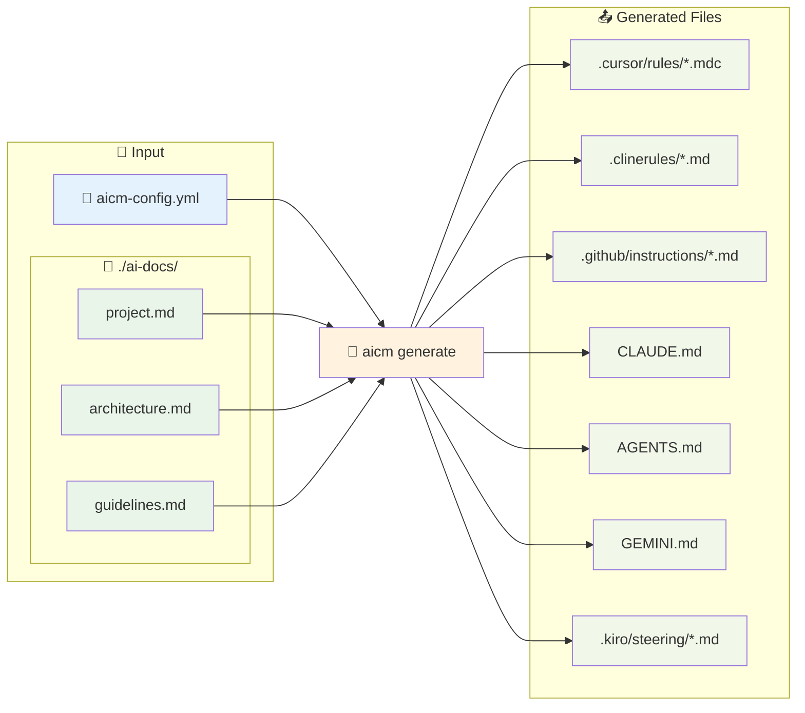

# AI Context Management Tool (aicm) 🦀

<div align="center">

**Languages:** [🇺🇸 English](README.md) • [🇯🇵 日本語](README.ja.md)

</div>

複数の AI コーディングエージェント用のコンテキストファイルを統一設定から自動生成する Rust 製 CLI ツール

<div align="center">

[](https://www.rust-lang.org/)
[](https://opensource.org/licenses/MIT)
[](https://github.com/morooka-akira/aicm/actions)

[インストール](#インストール) • [クイックスタート](#クイックスタート) • [設定](#設定) • [テスト](#テスト) • [開発](#開発)

</div>

## ✨ 概要

**aicm**は、人気のある AI コーディングツール向けのコンテキスト管理を一元化することで、AI 支援開発を効率化します。各ツール用に個別の設定ファイルを維持する代わりに、プロジェクトコンテキストを一度定義するだけで、aicm がすべての AI アシスタント用の適切な形式を生成します。

`base_docs_dir`に配置したマークダウンファイルを読み込み、各エージェントのルールファイル形式に自動変換・展開することで、統一されたドキュメント管理を実現します。

### 🔄 動作原理



### 🎯 サポート対象ツール

| ツール                | 出力ファイル                             | 機能                               |
| --------------------- | ---------------------------------------- | ---------------------------------- |
| **✅ Cursor**         | `.cursor/rules/*.mdc`                    | Split_config 対応、ルールタイプ    |
| **✅ Cline**          | `.clinerules/*.md`                       | シンプルなマークダウンファイル     |
| **✅ GitHub Copilot** | `.github/instructions/*.instructions.md` | ApplyTo オプション、フロントマター |
| **✅ Claude Code**    | `CLAUDE.md`                              | 統合コンテキストファイル           |
| **✅ OpenAI Codex**   | `AGENTS.md`                              | 統合コンテキストファイル           |
| **✅ Google Gemini**  | `GEMINI.md`                              | 統合コンテキストファイル           |
| **✅ Kiro**           | `.kiro/steering/*.md`                    | 分割ファイル、inclusion modes      |

## 🚀 インストール

### Homebrew を使う（macOS/Linux）

```bash
brew tap morooka-akira/aicm
brew install aicm
```

### Cargo を使用（推奨）

```bash
# crates.ioからインストール（近日公開予定）
cargo install aicm

# GitHubから直接インストール
cargo install --git https://github.com/morooka-akira/aicm

# ローカルビルド・インストール
git clone https://github.com/morooka-akira/aicm
cd aicm
cargo install --path .
```

### 必要な環境

- Rust 1.70.0 以上
- Cargo（Rust と一緒にインストールされます）

## ⚡ クイックスタート

```bash
# プロジェクトに設定を初期化
aicm init

# 設定ファイルを編集
vim aicm-config.yml

# 有効化されたすべてのエージェント用コンテキストファイルを生成
aicm generate

# 特定のエージェントのみ生成
aicm generate --agent cursor

# バージョン確認
aicm --version
# または
aicm -V

# 設定を検証
aicm validate
```

### コマンドリファレンス

| コマンド        | オプション                                       | 説明                                         |
| --------------- | ------------------------------------------------ | -------------------------------------------- |
| `aicm init`     | -                                                | 現在のディレクトリに設定テンプレートを初期化 |
| `aicm generate` | `--agent <name>`, `--config <path>`, `-c <path>` | AI エージェント用コンテキストファイルを生成  |
| `aicm validate` | `--config <path>`, `-c <path>`                   | 設定ファイルの構文と設定を検証               |
| `aicm --version` | `-V`, `--version`                                | バージョン情報を表示                        |

#### オプション詳細

| オプション        | 短縮形 | タイプ | 説明                                                                       |
| ----------------- | ------ | ------ | -------------------------------------------------------------------------- |
| `--agent <name>`  | -      | string | 特定のエージェントのみファイル生成（cursor, cline, github, claude, codex, gemini, kiro） |
| `--config <path>` | `-c`   | path   | aicm-config.yml の代わりに代替設定ファイルを使用                           |
| `--version`       | `-V`   | -      | Cargo.toml から現在のバージョンを表示                                     |

## 📖 設定

### 基本設定

プロジェクトルートに`aicm-config.yml`ファイルを作成：

```yaml
# aicm-config.yml
version: "1.0"
output_mode: split # merged | split
include_filenames: false # mergedモードでファイル名ヘッダーを含める
base_docs_dir: ./ai-docs

# シンプルなエージェント設定
agents:
  cursor: true
  cline: false
  github: true
  claude: true
  codex: false
  gemini: false
  kiro: false
```

### 高度な設定

```yaml
version: "1.0"
output_mode: split
include_filenames: false
base_docs_dir: ./ai-context

agents:
  # split_config付きの高度なCursor設定
  cursor:
    enabled: true
    output_mode: split
    include_filenames: true
    base_docs_dir: ./cursor-docs  # エージェント固有のドキュメントディレクトリ
    split_config:
      rules:
        - file_patterns: ["*project*", "*overview*"]
          alwaysApply: true
        - file_patterns: ["*architecture*", "*design*"]
          globs: ["**/*.rs", "**/*.ts"]
        - file_patterns: ["*development*", "*rules*"]
          description: "開発ガイドラインとコーディング規約"
        - file_patterns: ["*troubleshoot*", "*debug*"]
          manual: true

  # applyToオプション付きのGitHub Copilot
  github:
    enabled: true
    output_mode: split
    base_docs_dir: ./github-docs  # エージェント固有のドキュメントディレクトリ
    split_config:
      rules:
        - file_patterns: ["*backend*", "*api*"]
          apply_to: ["**/*.rs", "**/*.toml"]
        - file_patterns: ["*frontend*", "*ui*"]
          apply_to: ["**/*.ts", "**/*.tsx"]

  # Claude Code with import files (@filepath記法を使用)
  # import_filesを設定すると、指定したファイルを@filepath記法として埋め込むことができます
  # base_docs_dirと重複するファイルは自動的に除外され、import_files版のみが出力されます
  claude:
    enabled: true
    import_files:
      - path: "~/.claude/my-project-instructions.md"
        note: "個人のコーディングスタイル設定"
      - path: "./docs/api-reference.md"
        note: "API仕様書"
      - path: "/absolute/path/to/config.md"

  # Kiro with inclusion modes
  kiro:
    enabled: true
    split_config:
      rules:
        - file_patterns: ["*project*", "*readme*"]
          inclusion: always  # 常にすべてのインタラクションで含まれる
        - file_patterns: ["*api*", "*service*"]
          inclusion: fileMatch  # マッチするファイルでのみ含まれる
          match_pattern: "**/*.ts"
        - file_patterns: ["*troubleshooting*", "*guide*"]
          inclusion: manual  # #filename参照で手動で含まれる

  # シンプル設定
  cline: false
  codex: false
  gemini: false
```

### 外部設定ファイル

`--config` / `-c`オプションを使用して代替設定ファイルを指定：

```bash
# カスタム設定を使用
aicm generate --config production.yaml
aicm generate -c ./configs/staging.yaml

# 特定のエージェントと組み合わせ
aicm generate --agent cursor --config custom.yaml
```

### 設定リファレンス

| キー                                               | タイプ             | 必須 | デフォルト       | 説明                                      |
| -------------------------------------------------- | ------------------ | ---- | ---------------- | ----------------------------------------- |
| `version`                                          | string             | ✓    | `"1.0"`          | 設定ファイルバージョン                    |
| `output_mode`                                      | enum(split/merged) | ✓    | `"split"`        | ドキュメント出力モード                    |
| `base_docs_dir`                                    | string             | ✓    | `"./ai-context"` | ベースドキュメントディレクトリ            |
| `include_filenames`                                | boolean            | -    | `false`          | merged モードでファイル名ヘッダーを含める |
| `agents`                                           | map                | ✓    | -                | エージェント設定ブロック                  |
| `agents.<name>.enabled`                            | boolean            | -    | `true`           | エージェントの有効/無効                   |
| `agents.<name>.output_mode`                        | string             | -    | `"split"`        | エージェント固有の出力モード              |
| `agents.<name>.include_filenames`                  | boolean            | -    | `false`          | エージェント固有のファイル名ヘッダー      |
| `agents.<name>.base_docs_dir`                      | string             | -    | -                | エージェント固有のドキュメントディレクトリ |
| `agents.<name>.split_config.rules`                 | list               | -    | -                | ファイル分割ルール設定                    |
| `agents.<name>.split_config.rules[].file_patterns` | list<string>       | ✓    | `["*project*"]`  | ファイルマッチングパターン（glob）        |
| `agents.cursor.split_config.rules[].alwaysApply`   | boolean            | -    | `false`          | 常に適用するルール                        |
| `agents.cursor.split_config.rules[].description`   | string             | -    | -                | ルールの説明                              |
| `agents.cursor.split_config.rules[].manual`        | boolean            | -    | `false`          | 手動参照のみ                              |
| `agents.cursor.split_config.rules[].globs`         | list<string>       | -    | -                | 自動添付ファイルパターン                  |
| `agents.github.split_config.rules[].apply_to`      | list<string>       | -    | -                | 適用対象ファイルパターン                  |
| `agents.claude.import_files`                       | list               | -    | -                | @filepath記法でインポートするファイル     |
| `agents.claude.import_files[].path`                | string             | ✓    | -                | ファイルパス（絶対、相対、または~/）      |
| `agents.claude.import_files[].note`                | string             | -    | -                | ファイルの説明（オプション）              |
| `agents.kiro.split_config.rules[].inclusion`       | enum               | ✓    | -                | inclusion mode (always/fileMatch/manual)  |
| `agents.kiro.split_config.rules[].match_pattern`   | string             | -    | -                | fileMatchモード用のファイルパターン       |

## 🏗️ プロジェクト構造

```
your-project/
├── ai-context/              # グローバルドキュメントディレクトリ（base_docs_dir）
│   ├── 01-project-overview.md
│   ├── 02-architecture.md
│   ├── 03-development-rules.md
│   └── 04-api-reference.md
├── cursor-docs/             # エージェント固有ドキュメント（cursor.base_docs_dir）
│   ├── cursor-specific.md
│   └── cursor-rules.md
├── github-docs/             # エージェント固有ドキュメント（github.base_docs_dir）
│   ├── backend-guide.md
│   └── frontend-guide.md
├── aicm-config.yml          # 設定ファイル
├── src/
│   └── main.rs
└── Cargo.toml
```

## 📤 生成される出力

### Cursor

```
.cursor/rules/
├── project-overview.mdc      # alwaysApply: true
├── architecture.mdc          # globs: ["**/*.rs"]
└── development-rules.mdc     # description: "..."
```

### GitHub Copilot

```
.github/instructions/
├── backend.instructions.md   # applyTo: "**/*.rs,**/*.toml"
└── frontend.instructions.md  # applyTo: "**/*.ts,**/*.tsx"
```

### Claude Code

```
CLAUDE.md                     # Claude Code（import files付きのmerged）
```

#### ✨ @path/to/import構文

**base_docs_dir（または外部ファイル）を @path/to/import構文 で埋め込むことができます**。`import_files` に指定されたファイルは Claude Code の @filepath記法として出力され、base_docs_dir と重複するファイルは自動的に重複排除されます。

**使用例:**

```yaml
# 設定ファイル
agents:
  claude:
    enabled: true
    import_files:
      # 個人設定ファイル
      - path: "~/.claude/my-project-instructions.md"
        note: "個人のコーディングスタイル設定"
      # プロジェクト外のファイル
      - path: "../shared/api-docs.md"
        note: "共通API仕様書"
      # noteなしのファイル
      - path: "./docs/database-schema.md"
```

**↓ 出力される CLAUDE.md**

```markdown
# 個人のコーディングスタイル設定
@~/.claude/my-project-instructions.md

# 共通API仕様書
@../shared/api-docs.md

@./docs/database-schema.md
```

### Kiro

```
.kiro/steering/
├── project-overview.md       # Split モードファイル
├── architecture.md
└── development-rules.md
```

### その他のエージェント

```
.clinerules/context.md        # Cline（merged）
AGENTS.md                     # OpenAI Codex（merged）
GEMINI.md                     # Google Gemini（merged）
```

## 🧪 テスト

```bash
# 全テスト実行
cargo test

# 特定のテストモジュール実行
cargo test config

# カバレッジ付き実行（cargo-tarpaulinが必要）
cargo install cargo-tarpaulin
cargo tarpaulin --out html

# 統合テスト
cargo test --test integration_test
```

## 🛠️ 開発

### セットアップ

```bash
git clone https://github.com/morooka-akira/aicm
cd aicm
cargo build
cargo test
```

### コード品質

```bash
# コードフォーマット
cargo fmt

# リンター実行
cargo clippy

# 全ターゲットチェック
cargo clippy --all-targets --all-features
```

### アーキテクチャ

```
src/
├── main.rs                 # CLIエントリーポイント
├── lib.rs                  # ライブラリエントリーポイント
├── config/                 # 設定管理
├── core/                   # コア機能
├── agents/                 # エージェント実装
└── types/                  # 型定義
```

## 🤝 コントリビューション

コントリビューションを歓迎します！以下の手順に従ってください：

1. リポジトリをフォーク
2. 機能ブランチを作成（`git checkout -b feature/amazing-feature`）
3. 変更を行う
4. 新機能にテストを追加
5. `cargo fmt`と`cargo clippy`を実行
6. 変更をコミット（`git commit -m 'Add amazing feature'`）
7. ブランチにプッシュ（`git push origin feature/amazing-feature`）
8. プルリクエストを開く

### 開発ガイドライン

- Rust のベストプラクティスとイディオムに従う
- 新機能に包括的なテストを追加
- ユーザー向け変更についてはドキュメントを更新
- 提出前に完全なテストスイートを実行
- 従来のコミットメッセージを使用

## 📄 ライセンス

このプロジェクトは MIT ライセンスの下でライセンスされています - 詳細は[LICENSE](LICENSE)ファイルを参照してください。

## 🙏 謝辞

このプロジェクトは優れた Rust エコシステムツールで構築されています：

- [clap](https://github.com/clap-rs/clap) - コマンドライン引数解析
- [tokio](https://github.com/tokio-rs/tokio) - 非同期ランタイム
- [serde](https://github.com/serde-rs/serde) - シリアライゼーションフレームワーク
- [anyhow](https://github.com/dtolnay/anyhow) - エラーハンドリング

## 📞 サポート

- 🐛 **バグ報告**: [GitHub Issues](https://github.com/morooka-akira/aicm/issues)
- 💡 **機能要求**: [GitHub Issues](https://github.com/morooka-akira/aicm/issues)
- 💬 **ディスカッション**: [GitHub Discussions](https://github.com/morooka-akira/aicm/discussions)

---
