# AI Context Management Tool (aicm) 🦀

<div align="center">

**Languages:** [🇺🇸 English](README.md) • [🇯🇵 日本語](README.ja.md)

</div>

A unified CLI tool built in Rust to automatically generate context files for multiple AI coding agents from a single configuration.

<div align="center">

[](https://www.rust-lang.org/)
[](https://opensource.org/licenses/MIT)
[](https://github.com/morooka-akira/aicm/actions)

[Installation](#installation) • [Quick Start](#quick-start) • [Configuration](#configuration) • [Testing](#testing) • [Development](#development)

</div>

## ✨ Overview

**aicm** streamlines AI-assisted development by centralizing context management for popular AI coding tools. Instead of maintaining separate configuration files for each tool, define your project context once and let aicm generate the appropriate formats for all your AI assistants.

The tool reads markdown files from `base_docs_dir` and automatically converts and deploys them into each agent's rule file format, enabling unified document management across all AI coding tools.

### 🔄 How it Works

```mermaid
flowchart LR
    subgraph "📁 Input"
        CONFIG[📄 aicm-config.yml]
        
        subgraph "📂 ./ai-docs/"
            DOC1[project.md]
            DOC2[architecture.md]
            DOC3[guidelines.md]
        end
    end
    
    PROCESS[🚀 aicm generate]
    
    subgraph "📤 Generated Files"
        OUT1[.cursor/rules/*.mdc]
        OUT2[.clinerules/*.md]
        OUT3[.github/instructions/*.md]
        OUT4[CLAUDE.md]
        OUT5[AGENTS.md]
    end
    
    CONFIG --> PROCESS
    DOC1 --> PROCESS
    DOC2 --> PROCESS
    DOC3 --> PROCESS
    
    PROCESS --> OUT1
    PROCESS --> OUT2
    PROCESS --> OUT3
    PROCESS --> OUT4
    PROCESS --> OUT5
    
    style CONFIG fill:#e3f2fd
    style DOC1 fill:#e8f5e8
    style DOC2 fill:#e8f5e8
    style DOC3 fill:#e8f5e8
    style PROCESS fill:#fff3e0
    style OUT1 fill:#f1f8e9
    style OUT2 fill:#f1f8e9
    style OUT3 fill:#f1f8e9
    style OUT4 fill:#f1f8e9
    style OUT5 fill:#f1f8e9
```



### 🎯 Supported Tools

| Tool                  | Output Files                             | Features                         |
| --------------------- | ---------------------------------------- | -------------------------------- |
| **✅ Cursor**         | `.cursor/rules/*.mdc`                    | Split_config support, rule types |
| **✅ Cline**          | `.clinerules/*.md`                       | Simple markdown files            |
| **✅ GitHub Copilot** | `.github/instructions/*.instructions.md` | ApplyTo options, frontmatter     |
| **✅ Claude Code**    | `CLAUDE.md`                              | Merged context file              |
| **✅ OpenAI Codex**   | `AGENTS.md`                              | Merged context file              |

## 🚀 Installation

### Using Homebrew (macOS/Linux)

```bash
brew tap morooka-akira/aicm
brew install aicm
```

### Using Cargo (Recommended)

```bash
# Install from crates.io (coming soon)
cargo install aicm

# Install directly from GitHub
cargo install --git https://github.com/morooka-akira/aicm

# Local build and install
git clone https://github.com/morooka-akira/aicm
cd aicm
cargo install --path .
```

### Requirements

- Rust 1.70.0 or higher
- Cargo (installed with Rust)

## ⚡ Quick Start

```bash
# Initialize configuration in your project
aicm init

# Edit the configuration file
vim aicm-config.yml

# Generate context files for all enabled agents
aicm generate

# Generate for a specific agent only
aicm generate --agent cursor

# Check version
aicm --version
# or
aicm -V

# Validate your configuration
aicm validate
```

### Command Reference

| Command         | Options                                          | Description                                            |
| --------------- | ------------------------------------------------ | ------------------------------------------------------ |
| `aicm init`     | -                                                | Initialize configuration template in current directory |
| `aicm generate` | `--agent <name>`, `--config <path>`, `-c <path>` | Generate context files for AI agents                   |
| `aicm validate` | `--config <path>`, `-c <path>`                   | Validate configuration file syntax and settings        |
| `aicm --version` | `-V`, `--version`                                | Display version information                            |

#### Option Details

| Option            | Short | Type   | Description                                                                   |
| ----------------- | ----- | ------ | ----------------------------------------------------------------------------- |
| `--agent <name>`  | -     | string | Generate files for specific agent only (cursor, cline, github, claude, codex) |
| `--config <path>` | `-c`  | path   | Use alternative configuration file instead of aicm-config.yml                 |
| `--version`       | `-V`  | -      | Display current version from Cargo.toml                                      |

## 📖 Configuration

### Basic Configuration

Create an `aicm-config.yml` file in your project root:

```yaml
# aicm-config.yml
version: "1.0"
output_mode: split # merged | split
include_filenames: false # Include file name headers in merged mode
base_docs_dir: ./ai-docs

# Simple agent configuration
agents:
  cursor: true
  cline: false
  github: true
  claude: true
  codex: false
```

### Advanced Configuration

```yaml
version: "1.0"
output_mode: split
include_filenames: false
base_docs_dir: ./ai-context

agents:
  # Advanced Cursor configuration with split_config
  cursor:
    enabled: true
    output_mode: split
    include_filenames: true
    base_docs_dir: ./cursor-docs  # Agent-specific documentation directory
    split_config:
      rules:
        - file_patterns: ["*project*", "*overview*"]
          alwaysApply: true
        - file_patterns: ["*architecture*", "*design*"]
          globs: ["**/*.rs", "**/*.ts"]
        - file_patterns: ["*development*", "*rules*"]
          description: "Development guidelines and coding standards"
        - file_patterns: ["*troubleshoot*", "*debug*"]
          manual: true

  # GitHub Copilot with applyTo options
  github:
    enabled: true
    output_mode: split
    base_docs_dir: ./github-docs  # Agent-specific documentation directory
    split_config:
      rules:
        - file_patterns: ["*backend*", "*api*"]
          apply_to: ["**/*.rs", "**/*.toml"]
        - file_patterns: ["*frontend*", "*ui*"]
          apply_to: ["**/*.ts", "**/*.tsx"]

  # Claude Code with import files (uses @filepath notation)
  # Setting import_files allows you to embed specified files using @filepath notation
  # Files that overlap with base_docs_dir are automatically excluded, with only the import_files version being output
  claude:
    enabled: true
    import_files:
      - path: "~/.claude/my-project-instructions.md"
        note: "Personal coding style preferences"
      - path: "./docs/api-reference.md"
        note: "API documentation"
      - path: "/absolute/path/to/config.md"

  # Simple configurations
  cline: false
  codex: false
```

### External Configuration Files

Use the `--config` / `-c` option to specify alternative configuration files:

```bash
# Use custom configuration
aicm generate --config production.yaml
aicm generate -c ./configs/staging.yaml

# Combine with specific agent
aicm generate --agent cursor --config custom.yaml
```

### Configuration Reference

| Key                                                | Type               | Required | Default          | Description                              |
| -------------------------------------------------- | ------------------ | -------- | ---------------- | ---------------------------------------- |
| `version`                                          | string             | ✓        | `"1.0"`          | Configuration file version               |
| `output_mode`                                      | enum(split/merged) | ✓        | `"split"`        | Document output mode                     |
| `base_docs_dir`                                    | string             | ✓        | `"./ai-context"` | Base documentation directory             |
| `include_filenames`                                | boolean            | -        | `false`          | Include file name headers in merged mode |
| `agents`                                           | map                | ✓        | -                | Agent configuration block                |
| `agents.<name>.enabled`                            | boolean            | -        | `true`           | Enable/disable agent                     |
| `agents.<name>.output_mode`                        | string             | -        | `"split"`        | Agent-specific output mode               |
| `agents.<name>.include_filenames`                  | boolean            | -        | `false`          | Agent-specific filename headers          |
| `agents.<name>.base_docs_dir`                      | string             | -        | -                | Agent-specific documentation directory   |
| `agents.<name>.split_config.rules`                 | list               | -        | -                | File splitting rules configuration       |
| `agents.<name>.split_config.rules[].file_patterns` | list<string>       | ✓        | `["*project*"]`  | File matching patterns (glob)            |
| `agents.cursor.split_config.rules[].alwaysApply`   | boolean            | -        | `false`          | Always apply rule                        |
| `agents.cursor.split_config.rules[].description`   | string             | -        | -                | Rule description                         |
| `agents.cursor.split_config.rules[].manual`        | boolean            | -        | `false`          | Manual reference only                    |
| `agents.cursor.split_config.rules[].globs`         | list<string>       | -        | -                | Auto-attach file patterns                |
| `agents.github.split_config.rules[].apply_to`      | list<string>       | -        | -                | Target file patterns for application     |
| `agents.claude.import_files`                       | list               | -        | -                | Files to import using @filepath notation |
| `agents.claude.import_files[].path`                | string             | ✓        | -                | File path (absolute, relative, or ~/)    |
| `agents.claude.import_files[].note`                | string             | -        | -                | Optional description for the file        |

## 🏗️ Project Structure

```
your-project/
├── ai-context/              # Global documentation directory (base_docs_dir)
│   ├── 01-project-overview.md
│   ├── 02-architecture.md
│   ├── 03-development-rules.md
│   └── 04-api-reference.md
├── cursor-docs/             # Agent-specific documentation (cursor.base_docs_dir)
│   ├── cursor-specific.md
│   └── cursor-rules.md
├── github-docs/             # Agent-specific documentation (github.base_docs_dir)
│   ├── backend-guide.md
│   └── frontend-guide.md
├── aicm-config.yml          # Configuration file
├── src/
│   └── main.rs
└── Cargo.toml
```

## 📤 Generated Output

### Cursor

```
.cursor/rules/
├── project-overview.mdc      # alwaysApply: true
├── architecture.mdc          # globs: ["**/*.rs"]
└── development-rules.mdc     # description: "..."
```

### GitHub Copilot

```
.github/instructions/
├── backend.instructions.md   # applyTo: "**/*.rs,**/*.toml"
└── frontend.instructions.md  # applyTo: "**/*.ts,**/*.tsx"
```

### Claude Code

```
CLAUDE.md                     # Claude Code (merged with import files)
```

Example output with import_files:

```markdown
# Project Overview
Base documentation content here...

# Personal coding style preferences
@~/.claude/my-project-instructions.md

# API documentation
@./docs/api-reference.md

@/absolute/path/to/config.md
```

#### ✨ Feature: Automatic Duplicate Exclusion

**aicm provides automatic content duplication prevention** for Claude Code. When a file specified in `import_files` also exists in `base_docs_dir`, the `base_docs_dir` version is automatically excluded from the output. Only the `import_files` version (using @filepath notation) will be included.

**Example scenario:**
- `base_docs_dir`: `./docs/` contains `api-reference.md`
- `import_files`: includes `./docs/api-reference.md`
- **Result**: Only `@./docs/api-reference.md` appears in CLAUDE.md (no duplicate content)

### Other Agents

```
.clinerules/context.md        # Cline (merged)
AGENTS.md                     # OpenAI Codex (merged)
```

## 🧪 Testing

```bash
# Run all tests
cargo test

# Run specific test module
cargo test config

# Run with coverage (requires cargo-tarpaulin)
cargo install cargo-tarpaulin
cargo tarpaulin --out html

# Integration tests
cargo test --test integration_test
```

## 🛠️ Development

### Setup

```bash
git clone https://github.com/morooka-akira/aicm
cd aicm
cargo build
cargo test
```

### Code Quality

```bash
# Format code
cargo fmt

# Run linter
cargo clippy

# Check all targets
cargo clippy --all-targets --all-features
```

### Architecture

```
src/
├── main.rs                 # CLI entry point
├── lib.rs                  # Library entry point
├── config/                 # Configuration management
├── core/                   # Core functionality
├── agents/                 # Agent implementations
└── types/                  # Type definitions
```

## 🤝 Contributing

We welcome contributions! Please follow these steps:

1. Fork the repository
2. Create a feature branch (`git checkout -b feature/amazing-feature`)
3. Make your changes
4. Add tests for new functionality
5. Run `cargo fmt` and `cargo clippy`
6. Commit your changes (`git commit -m 'Add amazing feature'`)
7. Push to your branch (`git push origin feature/amazing-feature`)
8. Open a Pull Request

### Development Guidelines

- Follow Rust best practices and idioms
- Add comprehensive tests for new features
- Update documentation for user-facing changes
- Run the full test suite before submitting
- Use conventional commit messages

## 📄 License

This project is licensed under the MIT License - see the [LICENSE](LICENSE) file for details.

## 🙏 Acknowledgments

This project is built with excellent Rust ecosystem tools:

- [clap](https://github.com/clap-rs/clap) - Command line argument parsing
- [tokio](https://github.com/tokio-rs/tokio) - Asynchronous runtime
- [serde](https://github.com/serde-rs/serde) - Serialization framework
- [anyhow](https://github.com/dtolnay/anyhow) - Error handling

## 📞 Support

- 🐛 **Bug Reports**: [GitHub Issues](https://github.com/morooka-akira/aicm/issues)
- 💡 **Feature Requests**: [GitHub Issues](https://github.com/morooka-akira/aicm/issues)
- 💬 **Discussions**: [GitHub Discussions](https://github.com/morooka-akira/aicm/discussions)

---
