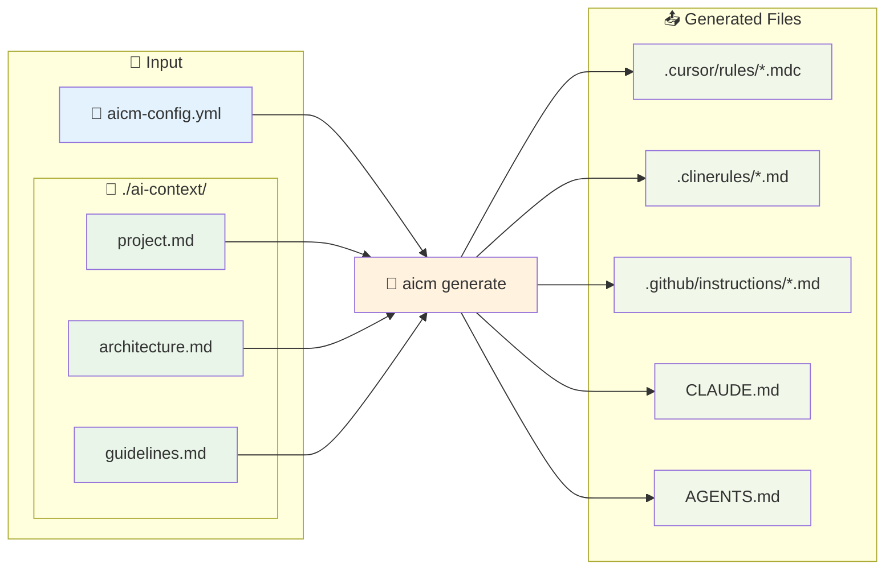

こんにちは、[Timelab](https://timelab.jp/)で [Lynx](https://lynxcat.app/)というカレンダーサービスを開発している諸岡（[@hakoten](https://twitter.com/hakotensan)）です。

最近、Claude Code、Cursor、Cline、GitHub Copilot など、AIを活用したコーディングエージェントが徐々に開発現場にも浸透し、開発効率を大幅に向上させてくれています。

これらのエージェントは、それぞれルールファイル(rules, instruction)というものを持っており、プロジェクトやチームのルールや指示をエージェントに反映することができます。

そこで今回は、社内で利用しているルールファイルを統一的に管理できるツール「[aicm](https://github.com/morooka-akira/aicm)」についてご紹介します。

## なぜこのツールを作ろうと思ったか

### 複数のエージェントを検証するためのツールが欲しかった

コーディングエージェントのアップデート速度は日進月歩であり、日々多くの機能やエージェントが登場する中で、現状弊社では社内で使うツールの一本化について決めかねています。

統一環境として、GitHub Copilot をメンバーに付与しているものの、CursorやClaude Codeなどの最新機能を手軽に使ってみたいというニーズがありました。

ですが、前述のとおり各エージェントでルールファイルのフォーマットが微妙に違っているため、ルールの更新を手作業でコピーするなど、同等な条件で検証できないという小さなストレスがあり、このツールを作りました。

ちなみに現状では、エージェントごとに以下のようなルールファイルが存在します。

| エージェント | ルールファイル | 参考リンク |
|---|---|---|
| **Cursor** | `.cursor/rules/*.mdc` | [Cursor Rules](https://docs.cursor.com/context/rules) |
| **Cline** | `.clinerules/*.md` | [Cline Rules](https://docs.cline.bot/features/cline-rules) |
| **GitHub Copilot** | `.github/copilot-instructions.md`<br/>`.github/instructions/*.instructions.md` | [GitHub Copilot Custom Instructions](https://docs.github.com/en/copilot/customizing-copilot/adding-repository-custom-instructions-for-github-copilot)<br/>[VS Code Copilot Customization](https://code.visualstudio.com/docs/copilot/copilot-customization#_use-instructionsmd-files) |
| **Claude Code** | `CLAUDE.md` | [Claude Code Memory (CLAUDE.md)](https://docs.anthropic.com/en/docs/claude-code/memory) |
| **OpenAI Codex** | `AGENTS.md` | [OpenAI Codex CLI](https://help.openai.com/en/articles/11096431-openai-codex-cli-getting-started) |

## aicm でできること

### 基本的な使い方

aicm を使うと、一つの設定ファイル（`aicm-config.yml`）から複数の AI エージェント用ルールファイルを自動生成できます。

```bash
# プロジェクトの初期化
aicm init

# 設定ファイルの編集
vim aicm-config.yml

# 全エージェント用ファイルの生成
aicm generate

# 特定のエージェントのみ生成
aicm generate --agent cursor
```

基本的な設定ファイルは以下のような形式です：

```yaml
# aicm-config.yml
version: "1.0"
output_mode: split
base_docs_dir: ./ai-context

agents:
  cursor: true
  cline: true
  github: true
  claude: true
  codex: false
```

### 動作の仕組み

aicm の動作は非常にシンプルです。設定ファイルとマークダウンファイルを読み込み、各エージェント用の形式に変換します：



このように、一度マークダウンファイルを作成すれば、各エージェント用のルールファイルが自動生成されるため、手作業でのコピーが不要になります。

### Cursor の mdc ファイル用設定

Cursor では、ルールファイルに対して適用条件を制御するために `mdc` というフォーマットでの設定に対応しています。

詳細については以下をご確認ください。

https://docs.cursor.com/context/rules


```yaml
agents:
  cursor:
    enabled: true
    output_mode: split
    split_config:
      rules:
        # 常に適用されるプロジェクト概要
        - file_patterns: ["*project*", "*overview*"]
          alwaysApply: true
        
        # Rust ファイルにのみ適用されるアーキテクチャールール
        - file_patterns: ["*architecture*", "*design*"]
          globs: ["**/*.rs", "**/*.ts"]
        
        # 開発ガイドライン（説明付き）
        - file_patterns: ["*development*", "*rules*"]
          description: "Development guidelines and coding standards"
        
        # マニュアル参照のみのトラブルシューティング
        - file_patterns: ["*troubleshoot*", "*debug*"]
          manual: true
```

これにより、以下のような `.cursor/rules/` ファイルが生成されます：

```markdown:project-overview.mdc
---
description:
globs:
alwaysApply: true
---

# プロジェクト概要
...
```

```markdown:architecture.mdc
---
description:
globs: ["**/*.rs", "**/*.ts"]
alwaysApply: false
---

# アーキテクチャ設計
...
```

### GitHub Copilot の applyTo 設定

GitHub Copilot でも、特定のファイルパターンにのみ適用される設定が可能です。

```yaml
agents:
  github:
    enabled: true
    output_mode: split
    split_config:
      rules:
        # バックエンド関連のファイルにのみ適用
        - file_patterns: ["*backend*", "*api*"]
          apply_to: ["**/*.rs", "**/*.toml"]
        
        # フロントエンド関連のファイルにのみ適用
        - file_patterns: ["*frontend*", "*ui*"]
          apply_to: ["**/*.ts", "**/*.tsx"]
```

生成される `.github/instructions/` ファイルは以下のようになります：

```markdown:backend.instructions.md
---
applyTo: "**/*.rs,**/*.toml"
---

# バックエンド開発ガイドライン
...
```

### 出力モード

aicm では、以下の出力モードをサポートしています。

1. **Split モード**: 各ドキュメントを個別ファイルとして出力（Cursor、Cline、GitHubのみ）
2. **Merged モード**: 全ドキュメントを一つのファイルに結合

エージェントごとに個別の設定も可能です：

```yaml
output_mode: split  # グローバル設定

agents:
  cursor:
    output_mode: split  # 個別ファイルで管理
  claude:
    output_mode: merged  # 一つのファイルに結合
```

## 終わりに

コーディングエージェントも各社どんどん進化しており、現状は色々と試行錯誤している段階です。
ニッチなツールではありますが、もしご興味をお持ちいただけましたら一度使ってみていただけると嬉しいです。

現在サポートしているエージェントは Cursor、Cline、GitHub Copilot、Claude Code、OpenAI Codex ですが、今後も新しいエージェントのサポートを追加していく予定です。
フィードバックや機能要望もお待ちしています！

https://github.com/morooka-akira/aicm

---

Timelabでは、AIも積極的に活用し、Lynxをはじめとする「より有意義な時間をデザインする」開発を行っています。

もし、この記事に興味を持たれた方や弊社に興味がある方は、ぜひ私のXアカウント（[@hakoten](https://twitter.com/hakotensan)）やコメントで気軽にお声がけください。Timelabエンジニアチームで一緒に働けることを楽しみにしています。
